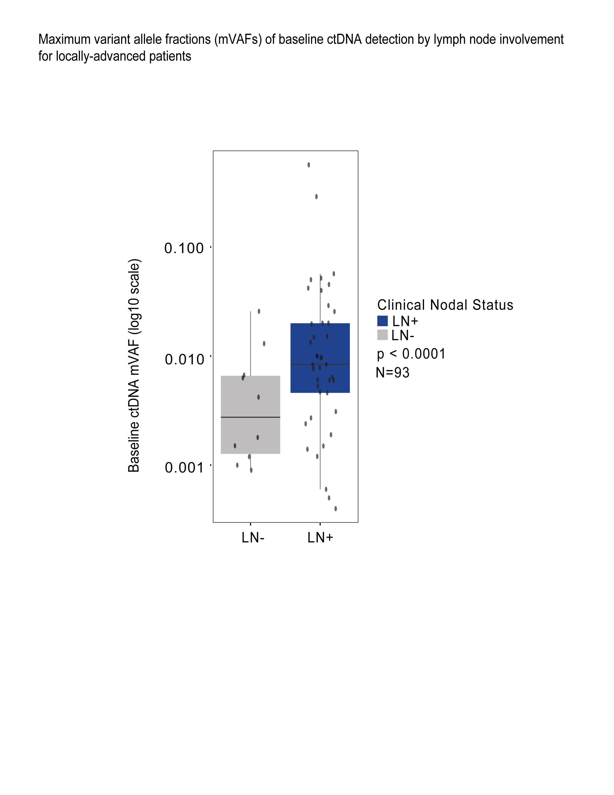

# Baseline Clinical Nodal Status and Baseline ctDNA mVAF Analysis

This module evaluates the relationship between **baseline clinical nodal status** and **baseline circulating tumor DNA (ctDNA) maximum variant allele fraction (mVAF)** using a boxplot-based comparison.

The analysis investigates whether patients with lymph node involvement at diagnosis exhibit different baseline ctDNA mVAF levels compared with patients without nodal involvement.

This repository is associated with work accepted for publication in **JCO Precision Oncology (JCO-PO)**.

---

# Analysis Overview

This module includes:

- comparison of baseline ctDNA mVAF between clinical nodal groups  
- Wilcoxon rank-sum test for statistical comparison  
- boxplot visualization with individual patient data points  
- log10-scaled y-axis for improved visualization of very small mVAF values  

The visualization shows both the **distribution of mVAF values** and **individual patient measurements**.

---

# Groups Compared

The grouping variable in this analysis is **clinical nodal status (cN)**.

Clinical nodal groups:

**LN-**  
Patients without clinical lymph node involvement.

**LN+**  
Patients with clinical lymph node involvement at diagnosis.

The analysis compares baseline ctDNA mVAF values between these two groups.

---

# Statistical Method

The statistical comparison in this analysis uses the **Wilcoxon rank-sum test (Mann-Whitney U test)**.

The Wilcoxon test is used instead of a parametric test such as the t-test because baseline ctDNA mVAF values typically:

- are extremely small in magnitude  
- are right-skewed  
- do not follow a normal distribution  
- may contain outliers  

Because of these characteristics, assumptions required for parametric tests are not satisfied.

The **Wilcoxon rank-sum test is a non-parametric test**, meaning it compares the distributions of the two groups without assuming normality of the data.

This makes it more appropriate for biomarker measurements such as ctDNA mVAF.

---

# Why a Log Scale is Used

The y-axis of the plot is displayed on a **log10 scale**.

This transformation is used because ctDNA mVAF values are typically **very small (often between 0.0001 and 0.1)**.

Using a log scale improves interpretability by:

- spreading out very small values that would otherwise cluster near zero  
- allowing differences across orders of magnitude to be visualized  
- improving comparison of distributions between clinical groups  

Without a log scale, most values would appear compressed near the bottom of the plot.

---

# Output

The resulting figure includes:

- boxplots representing the distribution of mVAF values  
- individual patient measurements shown as jittered points  
- log10-scaled mVAF values  
- Wilcoxon p-value annotation  
- total sample size displayed in the figure  

Example output:

---

# Code

The full reproducible analysis pipeline is available in:
boxplot_baseline_clinical_nodal_status_mvaf.R

The script contains detailed comments explaining each step of the statistical testing and visualization workflow.

---

# Reproducibility

The analysis was implemented in **R** using the following packages:

- `readxl`
- `dplyr`
- `ggplot2`

These packages are used for data import, data manipulation, and figure generation.

---

# Data Availability

Due to patient privacy regulations and institutional data governance policies, the dataset used in this analysis cannot be publicly shared.

This repository therefore provides the **analysis pipeline and figure generation code**, allowing the computational methodology to be reproduced with appropriate datasets.

---

# License

This project is released under the **MIT License**.
