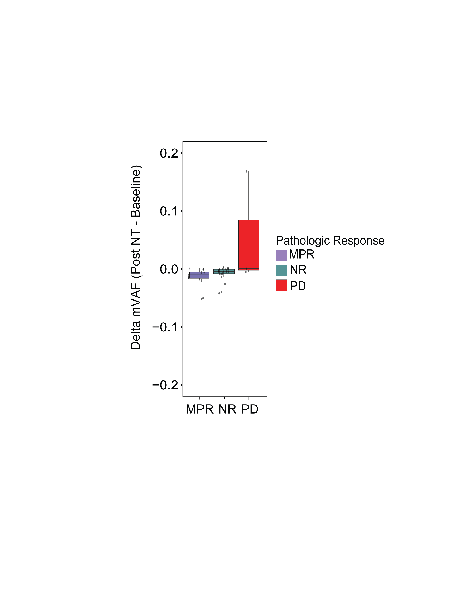

# Post-Treatment ctDNA Delta by Pathologic Response

This module evaluates differences in **post-treatment ctDNA change (Delta)** across pathologic response groups in patients who underwent **neoadjuvant therapy (NT)**.

The goal of this analysis is to determine whether **changes in circulating tumor DNA levels after treatment** differ depending on the degree of tumor response observed at surgery.

This repository is associated with work accepted for publication in **JCO Precision Oncology (JCO-PO)**.

---

# Clinical Context

Neoadjuvant therapy (NT) refers to **treatment administered before surgical tumor resection**, typically including chemotherapy, immunotherapy, radiation therapy, or combination regimens.

Following surgery, patients are classified based on **pathologic response**, which reflects the amount of residual tumor present in the surgical specimen.

The response groups used in this analysis are:

**MPR — Major Pathologic Response**  
Patients with ≤10% residual viable tumor in the surgical specimen.

**NR — Non-Responder**  
Patients with substantial residual tumor burden following therapy.

**PD — Progressive Disease**  
Patients whose disease progressed despite therapy.

Comparing ctDNA dynamics across these groups can provide insight into whether **ctDNA changes reflect treatment response**.

---

# Variable of Interest

The main variable analyzed in this module is:

**Delta_II**

This represents the **change in ctDNA signal between pre-treatment and post-treatment measurements**.

Positive or negative changes in this variable may reflect biological responses to therapy.

---

# Data Processing and Normalization

Prior to statistical analysis, the data undergo the following preprocessing steps:

1. **Removal of missing values**

Rows with missing `Delta_II` values are excluded to ensure valid statistical comparisons.

2. **Removal of zero values**

Rows where `Delta_II = 0` are removed for the primary analysis.

This filtering step is applied because:

- zero values may represent **measurement floor effects**
- extremely small changes may not reflect meaningful biological signal
- including them can distort group comparisons

The filtered dataset (`Delta_no_zero`) is used for all downstream statistical tests and plotting.

---

# Statistical Workflow

The statistical analysis follows a structured workflow:

1. Data cleaning and filtering  
2. Overall comparison between pathologic response groups  
3. Post-hoc pairwise group comparisons  
4. Visualization using boxplots with individual data points  

---

# Statistical Tests Used

## Welch's ANOVA

The primary statistical test used is **Welch's Analysis of Variance (Welch ANOVA)**.

Welch's ANOVA compares the means of multiple groups while **allowing for unequal variances across groups**.

This is important because biological data such as ctDNA measurements often exhibit:

- unequal group variances  
- unequal sample sizes  

Unlike standard ANOVA, Welch's ANOVA **does not assume homogeneity of variances**, making it more robust for biomedical datasets.

The Welch ANOVA therefore tests the hypothesis:

> Do mean Delta values differ across pathologic response groups?

---

## Games–Howell Post-Hoc Test

If the overall Welch ANOVA detects a significant difference, **pairwise group comparisons** are performed using the **Games–Howell test**.

The Games–Howell test is chosen because it:

- does **not assume equal variances**
- works well with **unequal group sizes**
- is considered the preferred post-hoc method following Welch ANOVA

The test compares each pair of response groups:

- MPR vs NR  
- MPR vs PD  
- NR vs PD  

This allows identification of **which specific groups differ statistically**.

---

# Visualization

The results are visualized using a **boxplot with jittered individual observations**.

The figure includes:

- distribution of Delta values within each response group
- individual patient-level measurements
- color-coded pathologic response groups
- Welch ANOVA p-value displayed in the title

The plot provides both:

- summary statistics (boxplots)
- raw patient-level variability (jittered points)

---

# Interpretation of the Plot

Each boxplot represents the distribution of **post-treatment ctDNA Delta values** for one pathologic response group.

The figure allows visual assessment of:

- whether ctDNA changes differ between response groups
- the spread and variability of Delta values
- potential outliers or extreme responses

If statistical differences exist, they may indicate that **ctDNA dynamics reflect underlying tumor response to therapy**.

---

# Code

The full reproducible analysis pipeline is available in:
delta_post_treatment_by_pathologic_response.R

The script includes detailed comments explaining each step of:

- data preprocessing  
- statistical testing  
- visualization  

---

# Output Figure

Example output:

---

# Reproducibility

The analysis was implemented in **R** using the following packages:

- `readxl`
- `dplyr`
- `ggplot2`
- `rstatix`

These packages are used for data import, statistical testing, and figure generation.

---

# Data Availability

Due to patient privacy regulations and institutional data governance policies, the dataset used for this analysis cannot be publicly shared.

This repository therefore provides the **analysis pipeline and figure generation code**, allowing the computational methodology to be reproduced with appropriate datasets.

---

# License

This project is released under the **MIT License**.
