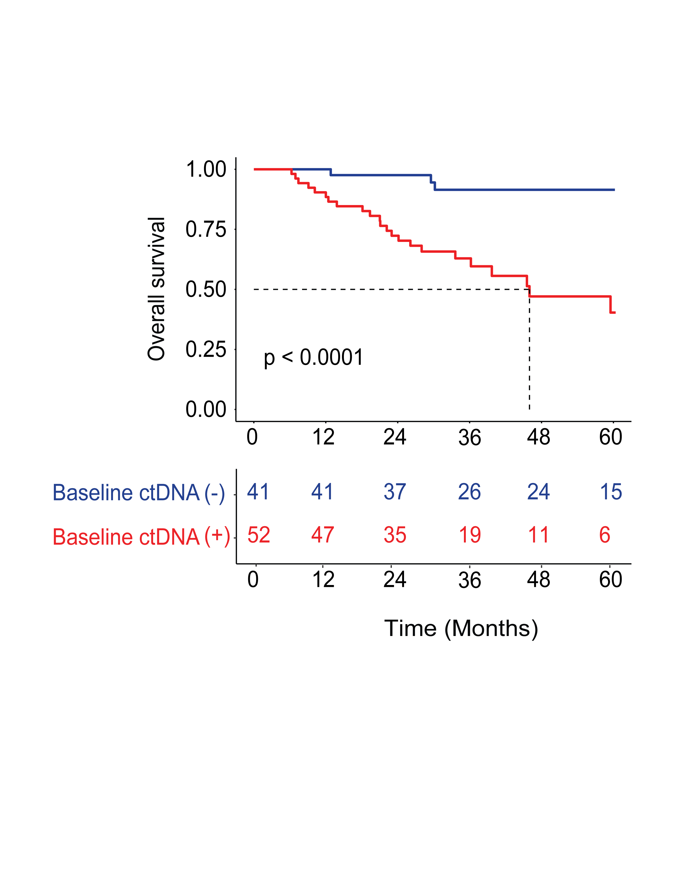

# Circulating Tumor DNA (ctDNA) Survival Analysis Through Liquid Biopsy


This repository contains analysis pipelines for studying circulating tumor DNA (ctDNA) using liquid biopsy data.

The project focuses on survival analysis and biomarker evaluation in oncology datasets using statistical methods commonly applied in translational cancer research.

The goal of this repository is to provide **clear, reproducible workflows for survival analysis** and demonstrate how ctDNA biomarkers can be evaluated in relation to clinical outcomes.

---

## Project Status

This repository is an actively developing research workflow for survival analysis of circulating tumor DNA (ctDNA) biomarkers.

Current focus:

- Kaplan–Meier survival modeling
- ctDNA-stratified survival comparisons
- visualization of survival outcomes

Future analyses will include Cox proportional hazards modeling and additional biomarker-driven survival analyses.

---

## Scientific Background

Circulating tumor DNA (ctDNA) detected through liquid biopsy is increasingly used as a biomarker for cancer prognosis, treatment monitoring, and minimal residual disease detection.

In clinical oncology studies, ctDNA status is frequently evaluated in relation to survival outcomes such as:

- overall survival (OS)
- recurrence-free survival (RFS)
- progression-free survival (PFS)

Survival analysis methods allow researchers to estimate survival probabilities over time and compare outcomes between biomarker-defined patient groups.

---

## Key Features

- Reproducible Kaplan–Meier survival analysis workflows
- Clear documentation for each analysis module
- Publication-style survival plots
- Modular repository structure allowing additional survival endpoints
- Easily adaptable to other oncology datasets

---

## Analyses Included

Current analyses implemented in this repository:

- Overall survival (Kaplan–Meier)
- Recurrence-free survival
- Progression-free survival

Additional analyses may be added as the project expands.

---

## Repository Structure

```
circulating-tumor-dna-liquid-biopsy
│
├── overall-survival
│   ├── README.md
│   ├── km_overall_survival.R
│   └── GitHub_Overall_Survival.png
│
├── recurrence-free-survival
│
├── progression-free-survival
│
├── LICENSE
└── README.md
```

Each analysis folder contains:

- the R script used for analysis  
- the resulting figure  
- documentation describing the workflow  

---

## Workflow Overview

The general workflow for each survival analysis follows these steps:

```
Clinical dataset
      ↓
Data preprocessing
      ↓
Create survival object
      ↓
Kaplan–Meier survival model
      ↓
Log-rank statistical test
      ↓
Visualization of survival curves
```

---

## Example Output

Kaplan–Meier overall survival comparison stratified by baseline ctDNA status.



---

## Methods

The survival analyses implemented in this repository include:

- Kaplan–Meier survival estimation  
- Log-rank test for survival curve comparison  
- Median survival estimation  
- Confidence interval estimation  
- Risk table visualization  

These methods are standard tools in clinical oncology research for evaluating patient outcomes over time.

---

## Requirements

R version ≥ 4.0 recommended.

Required packages:

- `survival`
- `survminer`
- `readxl`
- `tidyverse`

Install required packages in R:

```r
install.packages(c("survival","survminer","readxl","tidyverse"))
```

---

## Data Availability

The clinical datasets used for these analyses are **not included in this repository** due to data sharing restrictions related to patient privacy and institutional policies.

However, the code provided here can be applied to any dataset containing standard survival variables such as:

- follow-up time
- event indicator
- biomarker grouping variable

---

## Reproducibility

To reproduce the analyses:

1. Prepare a dataset containing survival time and event indicators.
2. Update the file path in the R scripts to point to your dataset.
3. Run the provided R scripts to generate Kaplan–Meier survival curves and statistical summaries.

---

## Related Publication

This repository accompanies research analysis workflows **associated with work accepted for publication in the Journal of Clinical Oncology – Precision Oncology (JCO-PO).**

Full citation details will be updated upon publication.

---

## Future Work

Planned extensions of this repository include:

- Cox proportional hazards modeling
- Multivariable survival analysis
- Longitudinal ctDNA dynamics analysis
- Biomarker threshold optimization
- Integration with additional clinical covariates

---

