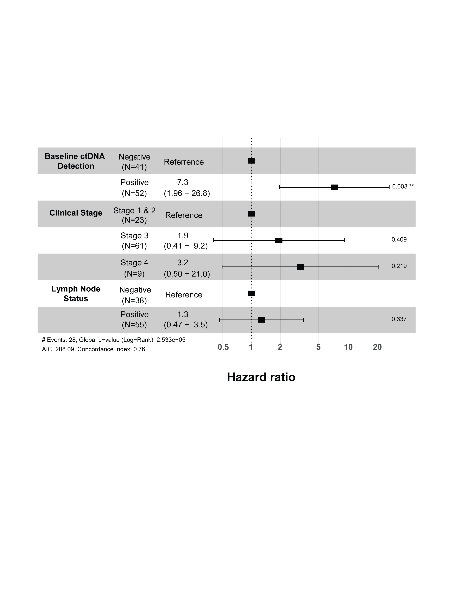

# Cox Multivariable Model for Localized Cohort

This module performs **univariate and multivariable Cox proportional hazards regression** for the localized cohort to evaluate associations between baseline clinical variables and **overall survival (OS)**.

The analysis examines whether **clinical stage**, **baseline ctDNA detection**, and **lymph node status** are associated with hazard of death, both individually and after adjustment for the other variables.

This repository is associated with work accepted for publication in **JCO Precision Oncology (JCO-PO)**.

---

# Clinical Context

This analysis focuses on the **localized cohort**, meaning patients with localized disease rather than metastatic disease.

The outcome of interest is **overall survival (OS)**, defined using:

- **OS_Months** = follow-up time in months
- **survival_status** = event indicator
  - `1` = death
  - `0` = censored

The predictors included in this model are:

- **Clinical stage**
- **Baseline ctDNA detection**
- **Lymph node status**

Clinical stage 1 was merged into stage 2 prior to modeling, so the final clinical stage categories used are:

- **Stage 2**
- **Stage 3**
- **Stage 4**

---

# Why Cox Regression Is Used

This analysis uses the **Cox proportional hazards model**, which is a standard method for analyzing time-to-event data in clinical research.

Cox regression is appropriate here because:

- the outcome is **survival time**
- some patients may be **censored**
- the goal is to estimate how baseline variables affect the **hazard of death over time**

Unlike linear regression, Cox regression accounts for both:

- the timing of events
- censoring

Unlike Kaplan-Meier analysis, Cox regression allows inclusion of **multiple predictors simultaneously**.

---

# What the Hazard Ratio Means

The main effect estimate in a Cox model is the **hazard ratio (HR)**.

The hazard ratio compares the hazard of death between one group and a reference group.

Interpretation:

- **HR = 1** → no difference in hazard
- **HR > 1** → higher hazard of death compared with reference
- **HR < 1** → lower hazard of death compared with reference

For example, if baseline ctDNA positive patients have an HR of 7.3, this means they have a substantially higher hazard of death compared with baseline ctDNA negative patients, after accounting for the model structure.

---

# Why Univariate Analysis Is Performed First

This workflow begins with **univariate Cox regression** for each predictor separately.

Univariate models are useful because they show the association between each variable and survival **on its own**, without adjustment for other variables.

This provides a first-pass view of whether each predictor appears prognostic.

The univariate models include:

- clinical stage alone
- baseline ctDNA detection alone
- lymph node status alone

---

# Why Multivariable Analysis Is Then Performed

After the univariate models, a **multivariable Cox model** is fit including all selected variables simultaneously.

This step is important because many clinical variables are correlated with one another.

For example:

- higher clinical stage may be associated with lymph node positivity
- ctDNA detection may also correlate with disease burden

The multivariable model estimates the **independent association** of each variable with overall survival while adjusting for the others.

This helps determine which variables remain prognostic after controlling for potential confounding.

---

# Variables Included in the Model

## 1. Clinical Stage

Clinical stage is included as a categorical factor with:

- **Stage 2** as the reference group
- Stage 3 compared with Stage 2
- Stage 4 compared with Stage 2

This allows estimation of how increasing stage is associated with survival risk.

---

## 2. Baseline ctDNA Detection

Baseline ctDNA detection is included as:

- **Negative** = reference
- Positive

This variable tests whether patients with detectable ctDNA at baseline have worse overall survival compared with patients without detectable ctDNA.

---

## 3. Lymph Node Status

Lymph node status is included as:

- **Negative** = reference
- Positive

This variable evaluates whether nodal involvement is associated with hazard of death.

---

# Statistical Workflow

The analysis follows this sequence:

1. Import the localized cohort dataset  
2. Convert predictors to categorical factors with interpretable labels  
3. Fit univariate Cox models for each predictor  
4. Fit a multivariable Cox model including all predictors  
5. Summarize hazard ratios and confidence intervals  
6. Visualize results using a forest plot  

This workflow allows both **individual predictor assessment** and **adjusted multivariable interpretation**.

---

# Forest Plot

The multivariable Cox model is visualized using a **forest plot**.

A forest plot provides a compact display of:

- hazard ratios
- 95% confidence intervals
- reference categories
- p-values

This makes it easier to interpret the magnitude and precision of the estimated associations.

The vertical reference line at **HR = 1** indicates no effect.

Variables whose confidence intervals lie mostly to the right of 1 suggest increased hazard relative to the reference group.

---

# Output Figure

Example output:

---

# Code

The full reproducible analysis pipeline is available in:
cox_multivariable_localized_cohort.R
