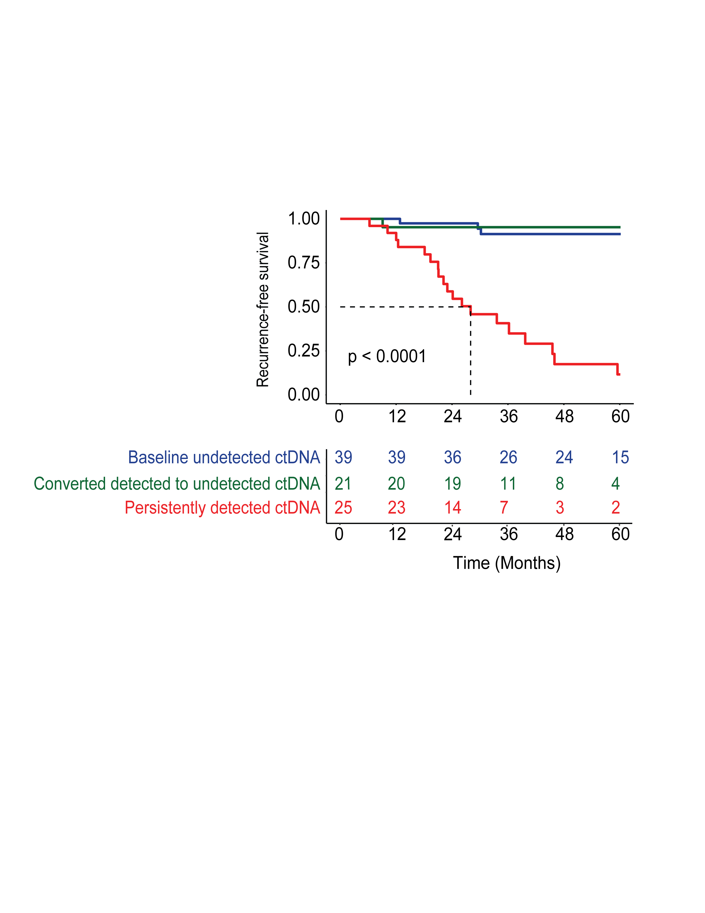

# On-Treatment ctDNA Response and Recurrence-Free Survival Analysis

This module performs Kaplan–Meier survival analysis to evaluate **recurrence-free survival (RFS)** stratified by **on-treatment circulating tumor DNA (ctDNA) response status**.

The analysis examines how recurrence-free survival differs depending on whether ctDNA was undetectable at baseline, cleared during treatment, or remained persistently detectable.

This repository is associated with work accepted for publication in **JCO Precision Oncology (JCO-PO)**.

---

# Group Definition

The grouping variable used in this analysis is **Converted**, which contains three biologically meaningful ctDNA response groups:

**0 — Baseline undetectable ctDNA**  
Patients who had no detectable ctDNA at baseline.

**1 — Converted detectable to undetectable ctDNA**  
Patients who had detectable ctDNA at baseline but became ctDNA-negative during treatment.

**2 — Persistent detectable ctDNA**  
Patients who had detectable ctDNA at baseline and continued to have detectable ctDNA during treatment.

These groups allow evaluation of whether **clearance of ctDNA during therapy is associated with improved recurrence-free survival**.

---

# Analysis Overview

This module includes:

- Kaplan–Meier survival estimation  
- Stratification by on-treatment ctDNA response group  
- Overall log-rank test  
- Pairwise log-rank comparisons between groups  
- Risk table displaying patients at risk over time  
- Median survival reference lines  

---

# Statistical Method

Survival curves were generated using the **Kaplan–Meier estimator** implemented in the `survival` R package.

Group comparisons were performed using the **log-rank test**.

Additional **pairwise log-rank tests** were performed to evaluate survival differences between specific ctDNA response groups.

The survival object used in this analysis is defined as:
Surv(RFS_Months, RFS_Status)

Where:

- **RFS_Months** = recurrence-free survival follow-up time in months  
- **RFS_Status** = recurrence event indicator  
  - `1` = recurrence  
  - `0` = censored  

---

# Output

The resulting Kaplan–Meier curve includes:

- recurrence-free survival probability over time  
- median survival reference lines  
- overall log-rank p-value  
- risk table showing number of patients at risk at each time point  

Example output:

---

# Code

The full reproducible analysis pipeline is available in:
km_on_treatment_ctdna_response_rfs.R

The script contains detailed comments explaining each step of the survival analysis workflow, including pairwise log-rank testing and Kaplan–Meier visualization.

---

# Reproducibility

The analysis was implemented in **R** using the following packages:

- `survival`
- `survminer`
- `readxl`

These packages are used for survival modeling, Kaplan–Meier visualization, pairwise group comparisons, and data import.

---

# Data Availability

Due to patient privacy regulations and institutional data governance policies, the dataset used for this analysis cannot be publicly shared.

This repository instead provides the **analysis pipeline and figure generation code**, allowing the computational methodology to be reproduced with appropriate datasets.

---

# License

This project is released under the **MIT License**.
