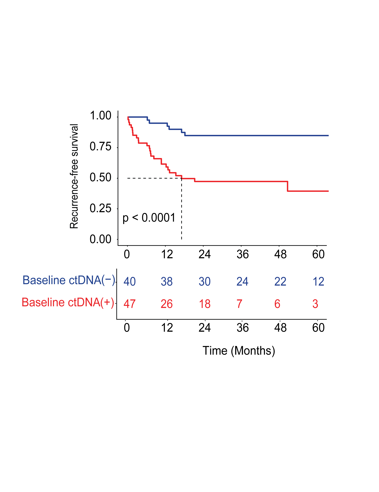

# Recurrence-Free Survival Analysis

This module performs Kaplan–Meier survival analysis to evaluate **recurrence-free survival (RFS)** stratified by **baseline circulating tumor DNA (ctDNA) detection status**.

The analysis demonstrates how ctDNA positivity at baseline is associated with an increased risk of recurrence following surgical treatment.

This repository is associated with work accepted for publication in **JCO Precision Oncology (JCO-PO)**.

---

# Cohort Definition

Recurrence-free survival analysis was performed on the subset of patients who **underwent surgical resection**.

Unlike the **overall survival analysis**, which includes the entire cohort, the RFS cohort is restricted to patients eligible for recurrence assessment following surgery.

As a result, the **number of patients shown in the risk table is lower** in this analysis compared to the overall survival module.

---

# Analysis Overview

This module includes:

* Kaplan–Meier survival estimation
* Stratification by baseline ctDNA status
* Log-rank test for survival comparison
* Risk table showing patients at risk over time
* Median survival reference lines

---

# Statistical Method

Survival curves were generated using the **Kaplan–Meier estimator** implemented in the `survival` R package.

Group comparisons were performed using the **log-rank test**.

Patients were stratified into two groups:

* **Baseline ctDNA negative**
* **Baseline ctDNA positive**

The survival object was defined using:

```
Surv(RFS_Months, RFS_Status)
```

where:

* **RFS_Months** = time to recurrence or censoring
* **RFS_Status** = recurrence indicator

---

# Output

The resulting Kaplan–Meier curve includes:

* survival probability over time
* median survival reference lines
* log-rank p-value
* risk table displaying number of patients at risk

Example output:



---

# Code

The full reproducible analysis pipeline is provided in:

```
km_recurrence_free_survival.R
```

The script contains detailed comments explaining each step of the survival analysis workflow.

---

# Reproducibility

The analysis was implemented in **R** using the following packages:

* `survival`
* `survminer`
* `readxl`

These packages are used for survival modeling, Kaplan–Meier visualization, and data import.

---

# Data Availability

Due to patient privacy regulations and institutional data governance policies, the dataset used for this analysis cannot be publicly shared.

This repository therefore provides the **analysis pipeline and figure generation code**, allowing the computational methodology to be reproduced with appropriate datasets.

---

# License

This project is released under the **MIT License**.
