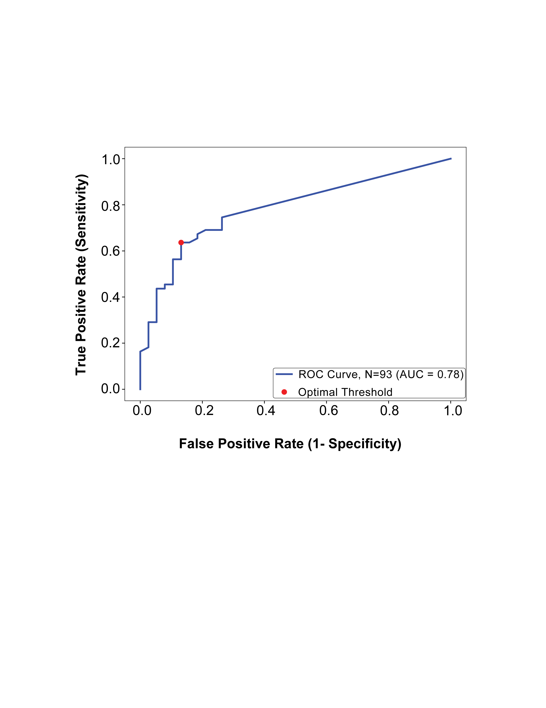

# ROC Analysis: Baseline ctDNA Max VAF vs Clinical Lymph Node Status

This module performs **Receiver Operating Characteristic (ROC) analysis** to evaluate whether **baseline circulating tumor DNA (ctDNA) maximum variant allele frequency (Max VAF)** can discriminate between **clinical lymph node positive and negative patients** in the localized esophagogastric cancer cohort.

The analysis quantifies the **diagnostic performance of baseline ctDNA levels as a predictor of nodal disease involvement**.

This repository is associated with work accepted for publication in **JCO Precision Oncology (JCO-PO)**.

---

# What Is a ROC Curve?

ROC stands for **Receiver Operating Characteristic**

A ROC curve is a graphical method used to evaluate the **diagnostic performance of a continuous biomarker or predictive model**.

It shows how well a predictor variable can distinguish between two outcome groups.

In this analysis:

Predictor: Baseline ctDNA maximum variant allele frequency (mVAF)

Outcome:

Clinical lymph node status
Positive vs Negative

The ROC curve evaluates whether **higher ctDNA levels are associated with lymph node positivity**.

---

# How a ROC Curve Works

The ROC curve plots two quantities across **all possible thresholds** of the predictor:

| Metric | Meaning |
|------|------|
| **True Positive Rate (TPR)** | Sensitivity |
| **False Positive Rate (FPR)** | 1 − Specificity |

The axes of the ROC plot are therefore:

X-axis: False Positive Rate (1-Specificity)
Y-axis: True Positive Rate (Sensitivity)

Each point on the ROC curve represents a **different threshold used to classify patients**.

For example, the model asks:

> If we classify patients as node-positive when baseline mVAF exceeds a specific threshold, how many true positives and false positives do we obtain?

By evaluating **every possible threshold**, the ROC curve shows the full trade-off between **sensitivity and specificity**.

---

# What Is AUC?

The **Area Under the Curve (AUC)** summarizes the ROC curve as a single number.

AUC measures the probability that a randomly chosen **node-positive patient** will have a higher ctDNA value than a randomly chosen **node-negative patient**.

Mathematically:
AUC = Probability that predictor ranks a positive case higher than a negative case

AUC ranges from **0 to 1**.

---

# Interpreting AUC Values

The table below provides a quick reference for interpreting AUC values.

| AUC | Interpretation |
|----|----|
| 0.50 | No discrimination (random guess) |
| 0.60 – 0.70 | Poor discrimination |
| 0.70 – 0.80 | Moderate discrimination |
| 0.80 – 0.90 | Good discrimination |
| 0.90 – 1.00 | Excellent discrimination |

In clinical biomarker studies, AUC values around **0.75–0.80** are commonly considered **clinically informative**.

---

# What This Analysis Evaluates

This ROC analysis evaluates whether:
Baseline ctDNA max VAF can predict Clinical lymph node positivity in patients with localized disease. The analysis uses patients from the following cohorts:

Pre_treatment_locally_advanced (Patients with clinical stage 2, 3 before getting neoadjuvant therapy)
Pre_treatment_early_stage (Patients with clinical stage 1)

These cohorts represent the **localized disease population prior to treatment**.

---

# What the Figure Shows

The ROC plot below visualizes the discrimination ability of baseline ctDNA Max VAF.

The figure contains the following components:

### Blue Curve
The ROC curve representing the relationship between sensitivity and false positive rate across all thresholds.

### Red Point
The **optimal threshold** selected using **Youden’s J statistic**.

### Grey Diagonal Line
Represents **random guessing** (AUC = 0.5).

Any model performing better than random should produce a curve **above this line**.

---

# Optimal Threshold Selection

The optimal threshold was identified using **Youden’s J statistic**.

Youden's J is defined as:
J = Sensitivity + Specificity - 1

or equivalently: J= TPR - FPR

The threshold that **maximizes Youden’s J** represents the best balance between:

- sensitivity
- specificity

This threshold is marked in the ROC plot as the **red point**.

---

# Clinical Interpretation

The ROC analysis tests the hypothesis that:

> Higher baseline ctDNA levels reflect greater tumor burden and therefore correlate with lymph node involvement.

If baseline ctDNA mVAF is predictive of nodal disease, patients with **higher mVAF values** should be more likely to have **positive lymph nodes**.

The ROC curve quantifies how well this relationship holds in the data.

---

# What the Code Does

The script: roc_baseline_mvaf_clinical_node.py

implements the complete ROC analysis pipeline.

The workflow proceeds as follows.

---

# Step 1 — Load the Dataset

The script imports the dataset containing:
Baseline_ctDNA_Max_VAF
clinical_node
Cohort

---

# Step 2 — Filter Relevant Cohorts

Only patients from the following cohorts are included:
Pre_treatment_locally_advanced (Patients with clinical stage 2, 3 before getting neoadjuvant therapy)
Pre_treatment_early_stage (Patients with clinical stage 1)

This restricts the analysis to the **localized disease population**.

---

# Step 3 — Convert Clinical Node Status to Binary

Clinical node status is converted to numeric form:
Positive = 1
Negative = 0

This allows it to be used as the **binary outcome variable** for ROC analysis.

---

# Step 4 — Define Predictor and Outcome Variables

The ROC analysis uses:
y_true = clinical_node
y_scores = Baseline_ctDNA_Max_VAF

Where:

- `y_true` represents the actual clinical node status
- `y_scores` represents the continuous biomarker measurement.

---

# Step 5 — Compute ROC Curve

The ROC curve is computed using:
sklearn.metrics.roc_curve

This function calculates:

- False Positive Rate (FPR)
- True Positive Rate (TPR)
- Thresholds used to classify patients.

---

# Step 6 — Calculate AUC

The **Area Under the Curve (AUC)** is calculated using:
sklearn.metrics.auc

This provides a single numerical measure of discriminatory performance.

---

# Step 7 — Identify the Optimal Threshold

The code calculates **Youden’s J statistic** across all thresholds and selects the one with the maximum value.

At this threshold, the script reports:
Sensitivity
Specificity

These values describe the classification performance at the optimal biomarker cutoff.

---

# Step 8 — Evaluate Classification Performance

Using the optimal threshold, the script calculates:

- Confusion matrix
- Accuracy
- Sensitivity
- Specificity
- Precision

These metrics quantify how well the threshold performs as a diagnostic rule.

---

# Step 9 — Generate ROC Plot

The script produces a publication-ready ROC plot showing:

- ROC curve
- AUC value
- Optimal threshold marker
- Random guess reference line

The figure is saved as:
GitHub_ROC_clinical_lymph.png

---

# Reproducibility

This analysis was implemented in **Python** using the following libraries:
pandas
numpy
matplotlib
scikit-learn

These libraries provide functionality for:

- data manipulation
- statistical modeling
- ROC analysis
- visualization.

---

# Data Availability

Due to institutional data governance policies and patient privacy regulations, the underlying dataset cannot be publicly shared.

This repository therefore provides the **analysis pipeline and visualization code**, allowing the methodology to be reproduced with appropriate datasets.

---

# License

This project is released under the **MIT License**.
