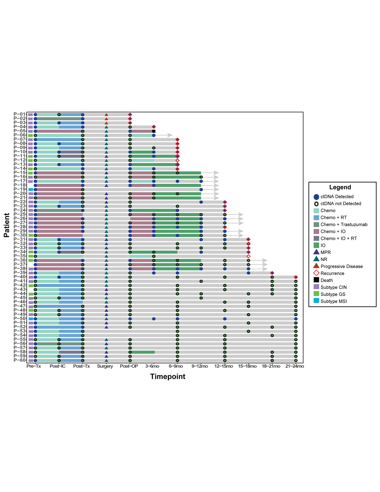

# Longitudinal ctDNA Swimmer Plot

This module generates a **swimmer plot visualizing longitudinal ctDNA detection, treatment exposure, pathologic response, and clinical outcomes** for individual patients.

The purpose of this visualization is to present **patient-level biomarker trajectories alongside treatment timelines and outcome events** in a single figure.

This repository is associated with work **accepted for publication in JCO Precision Oncology (JCO-PO)**.

---

# What Is a Swimmer Plot?

A **swimmer plot** is a visualization technique widely used in oncology research to display **individual patient timelines**.

Each row in the plot represents **one patient**, and the horizontal axis represents **time or treatment milestones**.

The name "swimmer plot" comes from the visual resemblance of horizontal bars to **swimming lanes**.

Swimmer plots are particularly useful for studies that involve:

- longitudinal biomarker measurements
- treatment exposures across time
- patient-level outcome events
- complex treatment sequences
- repeated observations per patient

Unlike summary statistics, swimmer plots allow the reader to **see the clinical journey of each patient individually**.

---

# What This Plot Shows

The swimmer plot in this project integrates several layers of information for each patient:

**1. Follow-up timeline**

A grey horizontal bar represents the observed timeline for each patient.

This shows how long each patient was followed during the study.

---

**2. ctDNA detection status**

ctDNA status is shown at each sampling timepoint.

- **Filled blue circle** → ctDNA detected  
- **Open dark green circle** → ctDNA not detected  

This allows visualization of **biomarker dynamics over time**.

---

**3. Treatment exposure**

Colored horizontal segments represent the treatments patients received.

Treatment categories include:

- Chemo (Chemotherapy)
- Chemo + RT (Chemotherapy with Radiotherapy)
- Chemo + Trastuzumab (Chemotherapy + Targeted therapy)
- Chemo + IO (Chemotherapy + Immunotherapy)
- Chemo + IO + RT (Chemotherapy + Immunotherapy + Radiotherapy)
- IO (Immunotherapy only)

These segments show **when each therapy was administered during the timeline**.

---

**4. Pathologic response**

At the surgery timepoint, triangles indicate the pathologic response category.

These include:

**MPR — Major Pathologic Response**  
Defined as ≤10% residual viable tumor in the surgical specimen.

**NR — Non-Responder**  
Patients with substantial residual tumor burden after therapy.

**Progressive Disease (PD)**  
Patients whose disease progressed despite treatment.

Displaying pathologic response alongside ctDNA status allows assessment of **whether ctDNA dynamics reflect treatment response**.

---

**5. Recurrence events**

A **red diamond marker** indicates the timepoint at which **disease recurrence was detected**.

This allows visual comparison between earlier ctDNA detection and later clinical relapse.

---

**6. Death events**

A **black square marker** indicates **patient death**.

Including this marker allows the swimmer plot to display **overall survival events alongside recurrence and biomarker status**.

---

**7. Molecular subtype annotation**

At baseline, each patient is annotated with their molecular subtype.

Subtype categories include:

- **CIN (Chromosomal Instability)**
- **GS (Genomically Stable)**
- **MSI (Microsatellite Instability)**

These subtype blocks provide **genomic context for biomarker behavior and outcomes**.

---

# Why Patients Are Ordered This Way

Patients are ordered to maximize interpretability.

Instead of alphabetical ordering, patients are sorted based on **clinical events and follow-up duration**.

The ordering logic is:

1. Patients with recurrence or death are ordered by **earliest event time**
2. Patients without events are ordered by **last follow-up time**

This arrangement allows the viewer to quickly identify:

- patients with **early relapse**
- patients with **long event-free follow-up**
- potential patterns between **ctDNA persistence and recurrence**

Ordering patients by clinical outcomes helps reveal **temporal relationships between biomarker status and disease progression**.

---

# Timepoints Used in the Plot

The x-axis represents clinically meaningful milestones in treatment and follow-up.

These include:

- **Pre-Tx** → before treatment  
- **Post-IC** → after induction chemotherapy  
- **Post-Tx** → after neoadjuvant therapy  
- **Surgery** → surgical resection  
- **Post-OP** → immediate postoperative evaluation  
- **3–6 months follow-up**
- **6–9 months follow-up**
- **9–12 months follow-up**
- **12–15 months follow-up**
- **15–18 months follow-up**
- **18–21 months follow-up**
- **21–24 months follow-up**

These timepoints allow ctDNA measurements and clinical events to be interpreted **within the context of treatment milestones**.

---

# Why This Visualization Is Valuable

This swimmer plot allows researchers to visually explore relationships between:

- ctDNA persistence or clearance
- treatment exposure
- pathologic response
- recurrence timing
- patient survival
- molecular subtype

Instead of analyzing each variable separately, the swimmer plot provides a **multidimensional patient-level summary**.

This is particularly useful in **translational oncology studies**, where the goal is to connect **biomarker dynamics with clinical outcomes**.

---

# Output Figure

Example output:

---

# Code

The full reproducible analysis pipeline is available in:
